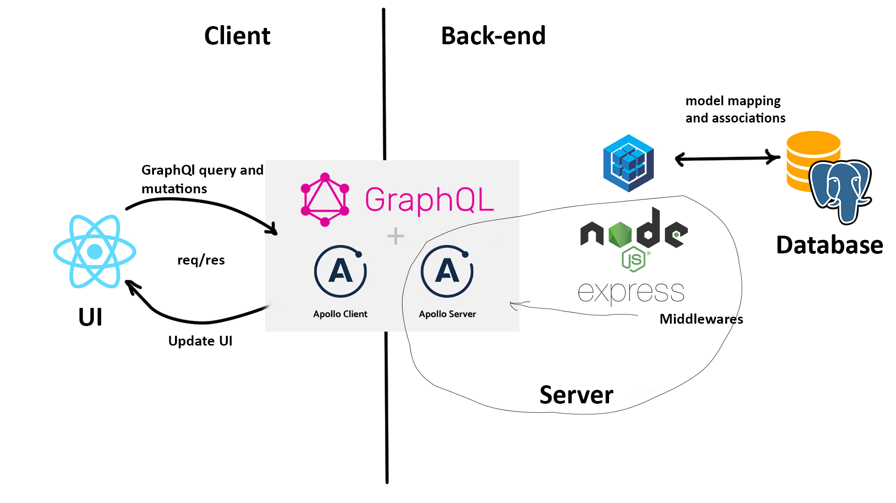
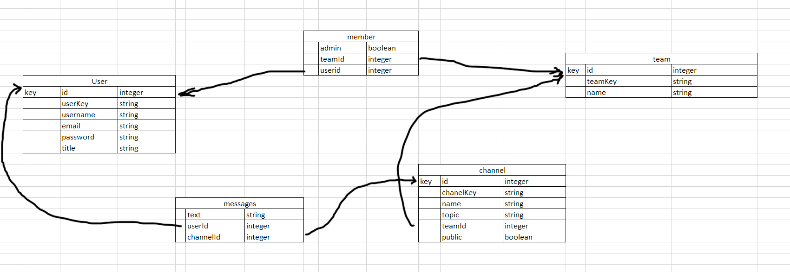

# Slack-Clone--SoftUni
 
Slack-Clone is SPA meant to mimic original Slack communication platform features.

# Architecture

<br>

# Set up and usage

**Database**

For database the application uses PostgreSQL. 
Before running in development mode install PostgreSQL for appropriate OS [link](https://www.postgresql.org/download/).

Database schema:

<br>

**Server**

The server runs on Node.js + Express and a Sequelize instance is used to create models for database.

This code snippet setups the Sequelize instance.
```js
import Sequelize from 'sequelize';

const sequelize = new Sequelize('slack', 'postgres', password, {
    dialect: 'postgres',
	define: {
		underscored: true,
	}
});

export default sequelize;
```

Extra setup and model associations are made in extra-setup.js [file](https://github.com/MartinPetrakiev/Slack-Clone--SoftUni/blob/main/server/models/extra-setup.js)
which are applied before exporting sequlize instance.

A documentation for Sequelize can be found [here](https://sequelize.org/master/).
More example code of how to setup Sequelize with Express can be found on [this repository](https://github.com/sequelize/express-example)

Between back-end and client I use GraphQL to control data. 
For this I use Apollo Server to setup schema types, resolvers and apply middlewares from express app. [Apollo Server docs](https://www.apollographql.com/docs/apollo-server/)

An instace of Appolo Server is made in [this file](https://github.com/MartinPetrakiev/Slack-Clone--SoftUni/blob/main/server/index.js) line 59.
There we pass our schema, create path for subscriptions, secure subscription connection and finally pass context to the server.
```js
server.installSubscriptionHandlers(httpServer);
```
This installs subscriptions handlers on the server and allows usage over ws://localhost:8080/subscriptions

Finally we initialize the server with this:
```js

async function init() {
  await assertDatabaseConnectionOk();
  console.log(`Starting Sequelize + Express example on port ${PORT}...`);
  await sequelize.sync();
  console.log("All models were synchronized successfully.");
  httpServer.listen(PORT, () => {
    console.log(`🚀 Server ready at http://localhost:${PORT}${server.graphqlPath}`);
    console.log(`🚀 Subscriptions ready at ws://localhost:${PORT}${server.subscriptionsPath}`);
  });
}
```

To build our tables and sync our database we use this:
```
 await sequelize.sync();
```
To drop the database on every server start we just pass parameters {force: true} like so:
```
 await sequelize.sync({force: true);
```


Run **`npm install`** or **`yarn install`** and then **`npm start`** or **`yarn start`** from inside the [api folder](https://github.com/MartinPetrakiev/Slack-Clone--SoftUni/tree/main/server). The server will start on `localhost:8080/graphql`.


**Client**

For client side I use React Library.
You can learn more in the [Create React App documentation](https://facebook.github.io/create-react-app/docs/getting-started).
To learn React, check out the [React documentation](https://reactjs.org/).

To fetch data from back-end I use Apollo Client which is connected to Apollo Server. [docs](https://www.apollographql.com/docs/react/)
We first create client instace where we apply server url and additional middlewares. [Client setup](https://github.com/MartinPetrakiev/Slack-Clone--SoftUni/blob/main/client/src/apollo.js)
Тhen we attach our client to React by wrapping `App` component with `ApolloProvider` and passing client as prop.

Example:
```js
import React from 'react';
import { render } from 'react-dom';

import { ApolloProvider } from '@apollo/client';

function App() {
  return (
    <ApolloProvider client={client}>
      <div>
        <h2>My first Apollo app 🚀</h2>
      </div>
    </ApolloProvider>
  );
}

render(<App />, document.getElementById('root'));
```

The `ApolloProvide` is similar to React's `Context.Provider`. It wraps your React app and places the client on the context, which enables you to access it from anywhere in your component tree.

To fetch data and make changes to the database in the client we use Apollo Client hooks:
`useQuery`, `useMutation` and we pass the gql fields and variables as initial values.
Example on how to use can be found on Apollo Client [docs](https://www.apollographql.com/docs/react/data/queries/)

*In code documentation.*
 	- There are 5 major directories graphql, routes, containers, components, styles.
1. `graphql` contains all queries, mutation and subscriptions fields which we use to fetch data from server.
2. `routes` contains all componets for the routes of the client and the [`Routes`](https://github.com/MartinPetrakiev/Slack-Clone--SoftUni/blob/main/client/src/routes/index.js) which specifies the navigation in the app. Public routes are only `Welcome`, `Register`, `Login`
3. `containers` contains the components that build our main page of the application `Home` or the client chat.
4. `components` contains all additional components - presentational, modals, popups, which build the client app logic, UI and feature functionality.
5. `styles` contains all component styles module files

# Contributing

-Martin Petrakiev
